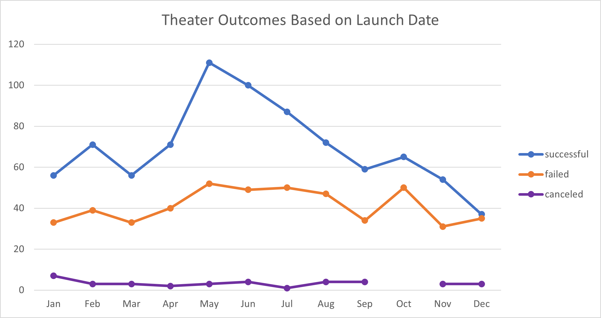
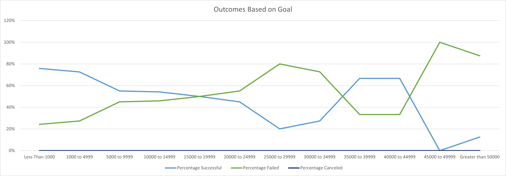

# Kickstarting with Excel
## Overview of Project
### This analysis looks at the outcomes of Kickstarter campaigns for plays based on two separate criteria; first is by campaign launch date and  second by campaign goal amount.  
## Analysis and Challenges
The data for Kickstarter campaigns were analyzed using a chart created from a pivot table that aggregated the campaigns by outcomes (successful, failed, and canceled) and organized by launch date.  The resulting chart allows us to visualize how successful or unsuccessful Kickstarter campaigns for plays were based on their launch date. The analysis includes all available data across multiple years which could potentially mask variances between the years included.  The data was further analyzed by charting the outcome of Kickstarter campaigns for plays based on the campaign goal amount.  Campaigns were grouped into ranges of goal amounts and campaign outcomes.
### Analysis of Outcomes Based on Launch Date

### Analysis of Outcomes Based on Goals

### Challenges and Difficulties Encountered
Successfully mananging and organizing the data is a potential challenge.  Being able to keep track of what data is included in the subsets and assuring the count of the aggregated data is necessary to assure a reliable conclusion can be drawn from the outcome.  Applying filters and cross checking the results of the manual filters to the pivot table results can help build assurance that all expected data is included in the analysis.  
## Results
Based on the number of occurences, campaigns launched in May were the most successful.  Additionally, campaigns launched in December had the fewest successful outcomes.  Campaigns launched in October had a slighter higher failure rate than other months.  Given the relatively flat trend of failed campaigns, additional analysis would be needed to determine how strongly correlated campaign outcomes are to their launch dates. 
Based on their outcomes, campaigns in the lower goal ranges were more frequently successful than those of higher goal ranges.  Comparing the successful versus failed campaigns over the different goal ranges shows a breakeven in the $15k to $20k range where the number of successful campaigns begin trending downward and the failed campaigns start to rise.  From $20k to $45k the trend it less defined and harder to draw predictable conclusions.  There is a clear departure in the ranges over $45k where a 100% of campaigns between $45k and $50k failed.  
